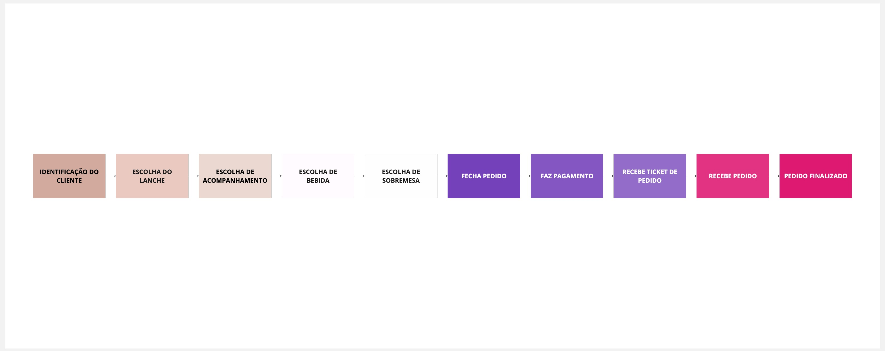

# Aplicação Fast Food - ALFAC

Esta é uma aplicação que tem por objetivo, fornecer uma plataforma de pedidos de fast food. A plataforma permite aos clientes seguir o fluxo comum de um pedido: escolher o lanche com seu complemento, acompanhamento, bebida e sobremesa. 

Ao final, o cliente irá realizar o pagamento deste pedido, através de um QR Code e por fim, receber seu pedido.

Para isso, o consumidor desta plataforma deve seguir o fluxo estabelecido na imagem a seguir:



Fluxo completo no MIRO:

[https://miro.com/app/board/uXjVKZNCxxM=/](https://miro.com/app/board/uXjVKZNCxxM=/)

---

## Tabela de conteúdos
- [Tecnologia](#tecnologia)
- [Requisitos](#requisitos)
- [Executar a aplicação](#executar-a-aplicação)
- Realização do pedido
  - [1. Se identificando](#1-se-identificando)
  - [2. Montando o `payload` com os itens seu pedido](#2-montando-o-payload-com-os-itens-seu-pedido)
  - [3. Registrando o seu pedido](#3-registrando-o-seu-pedido)
---

## Tecnologia

- Java 17 - _backend_
- MySQL 8 - _banco de dados_
- Swagger - _documentação e uso de API's_
- Docker - _orquestração da aplicação_
- Maven - _gerenciar dependências do backend_

## Requisitos

- Docker

## Executar a aplicação

    docker-compose up

# Realização do pedido

Uma vez a aplicação rodando, é necessário acessar o `Swagger` da aplicação pelo navegador: [http://localhost:8080/api-docs](http://localhost:8080/api-docs) ou [http://localhost:8080/swagger-ui/index.html](http://localhost:8080/swagger-ui/index.html)

O fluxo deve ser feito na sequência:

1. Se identificando
2. Montando o `payload` com os itens seu pedido, contendo:
  - Lanche
  - Acompanhamento
  - Bebida
  - Sobremesa
3. Registrando o seu pedido
4. Realizando o pagamento
5. Pedido sendo finalizado

## 1. Se identificando

Seguindo o cenário feliz, faça o cadastro do seu cliente. E com o id que irá retornar da `response`, você irá utilizá-lo nas etapas seguintes.

### Via Swagger

[http://localhost:8080/swagger-ui/index.html#/cliente-controller/cadastrarCliente](http://localhost:8080/swagger-ui/index.html#/cliente-controller/cadastrarCliente)

### Via Terminal

`POST http://localhost:8080/api/v1/clientes`

```bash
curl -X 'POST' \
'http://localhost:8080/api/v1/clientes' \
-H 'accept: */*' \
-H 'Content-Type: application/json' \
-d '{
    "nome": "Nome do cliente",
    "email": "email@provedor.com",
    "cpf": "12121212121"
}'
```

### Resposta

```bash
{
  "nome": "Nome do cliente",
  "cpf": null,
  "email": "email@provedor.com",
  "id": "92190798-aa89-4d7d-91f2-1e155688cbcd"
  "uuid": null
}
```

Com isso, você terá seu cliente cadastrado.

## 2. Montando o `payload` com os itens seu pedido

Você precisa escolher os itens que deseja. Para consultar os itens disponíveis:

### Via Swagger

[http://localhost:8080/swagger-ui/index.html#/item-controller/consultarItensPorCategoria_1](http://localhost:8080/swagger-ui/index.html#/item-controller/consultarItensPorCategoria_1)

### Via Terminal

Onde `CATEGORIA`:

- `LANCHE`;
- `COMPLEMENTO`;
- `ACOMPANHAMENTO`;
- `BEBIDA`;
- `SOBREMESA`;

`POST http://localhost:8080/api/v1/itens/por-categoria/{CATEGORIA}/itens`

Exemplo (pega todos os produtos (itens) disponíveis na categoria de LANCHE):

```bash

curl -X 'GET' \
  'http://localhost:8080/api/v1/itens/por-categoria/LANCHE/itens' \
  -H 'accept: application/json'
```

### Resposta

```json
[
  {
    "id": "d649a7fd-16f5-11ef-b59f-0242ac120002",
    "nome": "Hamburguer",
    "preco": 15,
    "categoria": "LANCHE"
  },
  {
    "id": "d649aad0-16f5-11ef-b59f-0242ac120002",
    "nome": "Hot Dog",
    "preco": 10,
    "categoria": "LANCHE"
  },
  ...
]
```

No fim, após escolher todos os itens, monte um objeto com a seguinte estrutura:

```json
{
  "clienteId": 1,
  "combos": [
    {
      "lanche": {
        "id": 15,
        "complementos": [
          {
             "id": 6
          }
        ],
        "observacoes": "Capricha no queijo!"
      },
      "acompanhamento": {
        "id": 8
      },
      "bebida": {
        "id": 11
      },
      "sobremesa": {
        "id": 14
      }
    }
  ]
}
```

O `payload` anterior contempla:

```
Cliente
id: 1
Nome: Joaquim Da Silva

Lanche
id: 15
Nome: Hamburguer

Complemento
id: 6
Nome: Queijo extra

Acompanhamento
id: 8
Nome: Batata Frita

Bebida
id: 11
Nome: Refrigerante

Sobremesa
id: 14
Nome: Sorvete
```

Basta então, registrar o pedido, como na próxima etapa.

## 3. Registrando o seu pedido

Envie o `payload` para o pedido ser registrado:


### Via Swagger

[http://localhost:8080/swagger-ui/index.html#/pedido-controller/registrarPedido](http://localhost:8080/swagger-ui/index.html#/pedido-controller/registrarPedido)

### Via Terminal

```bash
curl -X 'POST' \
  'http://localhost:8081/api/v1/pedidos' \
  -H 'accept: */*' \
  -H 'Content-Type: application/json' \
  -d '{
  "clienteId": 1,
  "combos": [
    {
      "lanche": {
        "id": 15,
        "complementos": [
          {
            "id": 6
          }
        ],
        "observacoes": "Capricha no queijo!"
      },
      "acompanhamento": {
        "id": 8
      },
      "bebida": {
        "id": 11
      },
      "sobremesa": {
        "id": 14
      }
    }
  ]
}'
```

### Resposta

```json
{
  "id": 2
}
```


## Roadmap

- [x] Cadastro do Cliente
- [x] Identificação do Cliente
- [x] Criar, editar e remover produtos (itens);
- [x] Buscar produtos por categoria;
- [x] Listar os pedidos;
- [x] Listar pedido por id;
- [x] Cadastrar item;
- [x] Atualizar status do pedido - combobox;
- [x] Validação dos itens do combo;
- [ ] Fake checkout (apenas enviar os produtos escolhidos para a fila. O checkout é a finalização do pedido);
- [ ] Dockerfile/docker-compose no docker-hub.

## Entregas

- **28/05/2024** - **<span style="color:red">AGUARDANDO</span>**

## Membros

**Leonardo Fraga**
- *RM354771*
- *[rm354771@fiap.com.br](mailto:rm354771@fiap.com.br)*
- [@LeonardoFraga](https://github.com/LeonardoFraga)

**Carlos Henrique Carvalho de Santana**
- *RM355339*
- *[rm355339@fiap.com.br](mailto:rm355339@fiap.com.br)*
- [@carlohcs](https://github.com/carlohcs)

**Leonardo Alves Campos**
- *RM355568*
- [rm355568@fiap.com.br](mailto:rm355568@fiap.com.br)
- [@lcalves](https://github.com/lcalves)

**Andre Musolino**
- *RM355582*
- *[rm355582@fiap.com.br](mailto:rm355582@fiap.com.br)*
- [@amusolino](https://github.com/amusolino)

**Ardiles Guerra**
- *RM355674*
- *[rm355674@fiap.com.br](mailto:rm355674@fiap.com.br)*
