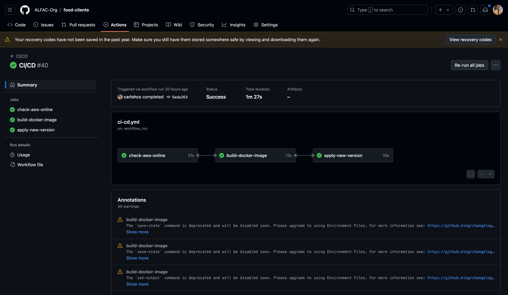

# Aplicação Fast Food - ALFAC

Esta é uma aplicação que tem por objetivo, fornecer uma plataforma de pedidos de fast food. A plataforma permite aos clientes seguir o fluxo comum de um pedido: escolher o lanche com seu complemento, acompanhamento, bebida e sobremesa.

Ao final, o cliente irá realizar o pagamento deste pedido, através de um QR Code e por fim, receber seu pedido.

Para isso, o consumidor desta plataforma deve seguir o fluxo estabelecido na imagem a seguir:


## Fluxo completo no MIRO

### Fase 1

- Brain Storming
- Event Storming
- Fluxo Vertical
- Linguagem Ubíqua

### Fase 2

- [Desenho da arquitetura](https://miro.com/app/board/uXjVKZNCxxM=/?moveToWidget=3458764595480615411&cot=10)
- [Requisitos da infraestrutura](https://drive.google.com/file/d/1SdsSAvb8gIy9qvau1m_bTNp2WUR5uzds/view?usp=sharing)

Veja em: [https://miro.com/app/board/uXjVKZNCxxM](https://miro.com/app/board/uXjVKZNCxxM=/?share_link_id=127959473892)

### Fase 3

Veja em: [https://miro.com/app/board/uXjVKZNCxxM=/?moveToWidget=3458764600931910148&cot=14](https://miro.com/app/board/uXjVKZNCxxM=/?moveToWidget=3458764600931910148&cot=14)

> [!WARNING]  
> **Essa documentação foca na 3° FASE do Tech Challenge - usando Terraform e GitHub Actions. Se precisar, consulte o README.md da 2° FASE no link: https://github.com/ALFAC-Org/food/tree/fase2-clean-arch**

## Tabela de conteúdos

- [Aplicação Fast Food - ALFAC](#aplicação-fast-food---alfac)
  - [Fluxo completo no MIRO](#fluxo-completo-no-miro)
    - [Fase 1](#fase-1)
    - [Fase 2](#fase-2)
    - [Fase 3](#fase-3)
  - [Tabela de conteúdos](#tabela-de-conteúdos)
  - [Tecnologia](#tecnologia)
    - [Na Nuvem](#na-nuvem)
  - [Requisitos](#requisitos)
  - [Arquitetura](#arquitetura)
    - [Visão Geral](#visão-geral)
  - [Executando a aplicação](#executando-a-aplicação)
    - [Tutoriais](#tutoriais)
    - [GitHub Actions (Recomendado)](#github-actions-recomendado)
    - [Localmente](#localmente)
  - [Fluxo do usuário](#fluxo-do-usuário)
  - [Roadmap](#roadmap)
  - [Entregas](#entregas)
  - [Membros](#membros)

## Tecnologia

- **Linguagem de Programação:** Java 17
- **Framework:** Spring Boot
- **Gerenciador de dependências:** Maven
- **Banco de dados:** MySQL 8
- **Documentação e uso de API's:** Swagger
- **Conteinerização:** Docker
- **Orquestração:** Kubernetes

### Na Nuvem

- **Web Services**:  AWS
- **IaC**: Terraform - v1.9.5

## Requisitos

- Docker _(versão 27.0.3)_ - para rodar localmente
- Kubernetes _(versão 1.30)_ - para rodar localmente e na nuvem (AWS)
- Terraform _(versão 1.9.5)_ - para rodar na nuvem (AWS) e GitHub Actions

## Arquitetura

### Visão Geral

A aplicação está estruturada no padrão de _Clean Architecture_. Pode ser executada tanto via _Docker_, _Kubernetes_ e _Terraform_. Podendo ser hospedada tanto localmente ou na nuvem, usando serviços como _AWS_. A interação da aplicação se dá através de _APIs_ com o _Swagger_ disponibilizado.

[Vídeo - Arquitetura da aplicação: Kubernetes + AWS](https://drive.google.com/file/d/1wuyAu3_Hne0w3iy7KY5_TZ-NDytB4kTw/view?usp=sharing)

[Vídeo - Arquitetura da aplicação: código e aplicação do Clean Architecture](https://youtu.be/H04AmyucSN0)

[Vídeo - Arquitetura da aplicação: Terraform + AWS + GitHub Actions](https://drive.google.com/file/d/1vJRNaJK86aQIZCpjcT6Hqpxg4Aq9JREv/view)

## Executando a aplicação

### Tutoriais

| Passo | Vídeo |
|-------|-------|
| 0. Introdução geral | [0-INTRODUCAO-GERAL](https://drive.google.com/file/d/1E9v5AYdDJZeDYTBuxv9MxESB194wfX2q/view?usp=drive_link) |
| 1. Introdução aos repositórios | [1-INTRODUCAO-REPOSITORIOS](https://drive.google.com/file/d/1jViIPSCdinQ0Dbvf9VCHRd_qryEZiHdz/view?usp=drive_link) |
| 2. Configuração das variáveis ambiente | [2-CONFIGURACAO-VARIAVEIS](https://drive.google.com/file/d/1QnLUTGbsOQ0hj0cI0CifeCAwBANxmy98/view?usp=drive_link) |
| 3. Provisão da infraestrutura com [https://github.com/ALFAC-Org/food-cloud-infra](https://github.com/ALFAC-Org/food-cloud-infra) | [3-INFRA-PARTE-1](https://drive.google.com/file/d/1J10-wJGOLysgZtSyTtVhfSJG-YrguhAi/view?usp=drive_link) / [3-INFRA-PARTE-2](https://drive.google.com/file/d/1Tzztu_W3Qx5WZdocE49yRNigKO4W1qkz/view?usp=drive_link) |
| 4. Provisão do banco de dados com [https://github.com/ALFAC-Org/food-database](https://github.com/ALFAC-Org/food-database) | [4-DATABASE-PARTE-1](https://drive.google.com/file/d/1FyC0uFHNiWsP8tH7p_mdzSRgtFazag2E/view?usp=drive_link) / [4-DATABASE-PARTE-2](https://drive.google.com/file/d/1TCs5dfF6cqnvYOK5kZ-d5RKUbrv9zruI/view?usp=drive_link) |
| 5. Provisão do lambda com [https://github.com/ALFAC-Org/food-serveless-function](https://github.com/ALFAC-Org/food-serveless-function) | [5-LAMBDA](https://drive.google.com/file/d/1djIEy_YctnqSyXRNUPC45prQ0wwiZjks/view?usp=drive_link) |
| 6. Provisão da aplicação principal com [https://github.com/ALFAC-Org/food](https://github.com/ALFAC-Org/food) | [6-FOOD](https://drive.google.com/file/d/1wHJnIbI-bFn25VH4hmYfrrW0xTxSAfKv/view?usp=drive_link) |
| 7. Demonstrando tudo: API Gateway + Lambda + Load Balancer + EKS junto do fluxo do usuário | [7-FLUXO](https://drive.google.com/file/d/1vJRNaJK86aQIZCpjcT6Hqpxg4Aq9JREv/view?usp=drive_link) |

### GitHub Actions (Recomendado)

<details>
  <summary>Passo a passo</summary>

1. Acesse [https://github.com/ALFAC-Org/food-food/actions](https://github.com/ALFAC-Org/food-food/actions) (A guia `Actions` deste repositório);
2. Acesse `CI/CD`;
3. Clique em `Run workflow` (ou Executar workflow);
4. Aguarde. Se tudo der certo, o `check` verde deverá aparecer - o processo dura em torno de 2 a 5 minutos;
   1. 

</details>

### Localmente

<details>
  <summary>Passo a passo</summary>

No terminal, execute:

Adicione _configmaps_ e _secrets_:

```bash
kubectl apply -f food/k8s/dev/shared
```

Adicione _banco de dados_:

```bash
kubectl apply -f food/k8s/dev/db
```

Adicionando _backend_:

```bash
kubectl apply -f food/k8s/dev/backend
```

(opcional) Adicione _autoscaling_:

```bash
kubectl apply -f food/k8s/dev/autoscaling
```

</details>

## Fluxo do usuário

Como fazer um pedido em nossa plataforma?

Veja em [Fluxo do usuário](./docs/FLUXO_USUARIO.md).

## Roadmap

<details>
  <summary>FASE 1</summary>

Veja em [https://github.com/ALFAC-Org/food/tree/hexagonal#roadmap](https://github.com/ALFAC-Org/food/tree/hexagonal#roadmap)

</details>

<details>
  <summary>FASE 2</summary>

Veja em [https://github.com/ALFAC-Org/food/tree/fase2-clean-arch?tab=readme-ov-file#roadmap](https://github.com/ALFAC-Org/food/tree/fase2-clean-arch?tab=readme-ov-file#roadmap)

</details>

<details>
  <summary>FASE 3</summary>

- [x] 1. Implementar um API Gateway e um `function serverless` para `autenticar o cliente` com base no CPF.
  - [x] 1. Integrar ao sistema de autenticação para identificar o cliente.
      1. Desenho (room): https://excalidraw.com/#room=1cf48787e8cd8028a3bd,Pb8UVcTDexZQseHv8VOFpQ
      2. Desenho (estático): https://excalidraw.com/#json=J_qszI3T0Q_ppK9SychFs,aBuXjzcOrsndQuOsvP9o4A
      
- [x] 2. Implementar as melhores práticas de `CI/CD` para a aplicação, segregando os códigos em repositórios, por exemplo:
  - [x] 1 repositório para o Lambda - repositório `food-serveless-function`.
  - [x] 1 repositório para sua infra Kubernetes com Terraform - repositório `food-cloud-infra`.
  - [x] 1 repositório para sua infra banco de dados gerenciáveis com Terraform - repositório `food-database`.
    4. 1 repositório para sua aplicação que é executada no Kubernetes - repositório `food`
- [x] 3. Os repositórios devem fazer deploy automatizado na conta da nuvem utilizando actions. As branchs `main/master` devem ser protegidas, não permitindo commits direto. Sempre utilize `pull request`.
- [x] 4. Melhorar a estrutura do banco de dados escolhido, documentar seguindo os padrões de modelagem de dados e justificar a escolha do banco de dados.
- [x] 5. Você tem a liberdade para escolher qual a infra de nuvem desejar, mas terá de utilizar os serviços serverless: functions (AWS Lamba, Azure functions ou Google Functions, por exemplo), banco de dados gerenciáveis (AWS RDS, Banco de Dados do Azure ou Cloud SQL no GCP, por exemplo), sistema de autenticação (AWS Cognito, Microsoft AD ou Google Identity platform no GCP, por exemplo).

</details>

## Checando a execução do github workflow actions

Add `--verbose` to see the logs.

- https://nektosact.com/
- `act --list`
- `act -j <job>`
- `act -j test-unit --container-architecture linux/amd64`

## Entregas

- FASE 1 - **28/05/2024** - **<span style="color:green">FEITO</span>**
- FASE 2 - **30/07/2024** - **<span style="color:green">FEITO</span>**
- FASE 3 - **01/10/2024** - **<span style="color:red">AGUARDANDO</span>**

## Membros

|Membro| Informações |
|--|--|
| Leonardo Fraga | - *RM354771* <br />- *[rm354771@fiap.com.br](mailto:rm354771@fiap.com.br)* <br />- [@LeonardoFraga](https://github.com/LeonardoFraga) |
| Carlos Henrique Carvalho de Santana | - *RM355339* <br />-  *[rm355339@fiap.com.br](mailto:rm355339@fiap.com.br)* <br />- [@carlohcs](https://github.com/carlohcs) |
| Leonardo Alves Campos | - *RM355568* <br />- [rm355568@fiap.com.br](mailto:rm355568@fiap.com.br) <br />- [@lcalves](https://github.com/lcalves) |
| Andre Musolino | -  *RM355582* <br />- *[rm355582@fiap.com.br](mailto:rm355582@fiap.com.br)* <br />- [@amusolino](https://github.com/amusolino) |
